<div align="center">

# LoomVideo: Unifying Multimodal Inputs into <br> Video Generation and Editing

<h3>Peking University &middot; Alibaba Group</h3>

<a href="https://arxiv.org/abs/2606.06042" target="_blank"></a>
<a href="https://huggingface.co/MSALab/LoomVideo" target="_blank"></a>
<a href="https://msalab-pku.github.io/projects/LoomVideo/index.html" target="_blank"></a>

</div>

# 🔥 News

- [2026-06-05] We release LoomVideo [paper](https://arxiv.org/abs/2606.06042) on Arxiv!
- [2026-06-02] We release the [codebase](https://github.com/MSALab-PKU/LoomVideo) and [model weights](https://huggingface.co/MSALab/LoomVideo) of LoomVideo!
- [2026-06-02] We release the [project page](https://msalab-pku.github.io/projects/LoomVideo/index.html) of LoomVideo!

# 📌 TL;DR

**The Problem:** Existing unified video generation & editing models are massive (13B+) and rely on token concatenation for source conditioning — doubling sequence length and quadrupling attention cost.

**The Method:** We present **LoomVideo**, a compact **5B-parameter** unified architecture built on MLLM + DiT that introduces three key designs:
- **Deepstack Injection** — extracts features from every MLLM layer and injects them into corresponding DiT layers via cross-attention, enabling rich multi-granular semantic guidance.
- **Scale-and-Add Conditioning** — a zero-overhead approach that scales the clean source latent by the current timestep and directly adds it to the noised target, completely bypassing token concatenation.
- **Negative Temporal RoPE** — assigns negative temporal indices to reference images, seamlessly integrating multi-image conditions without architectural modification.

**The Result:** Our 5B model achieves state-of-the-art or highly competitive performance across comprehensive benchmarks, with at least **5.41×** inference speedup over models of similar capabilities — demonstrating that efficiency and quality can coexist.

<p align="center">
  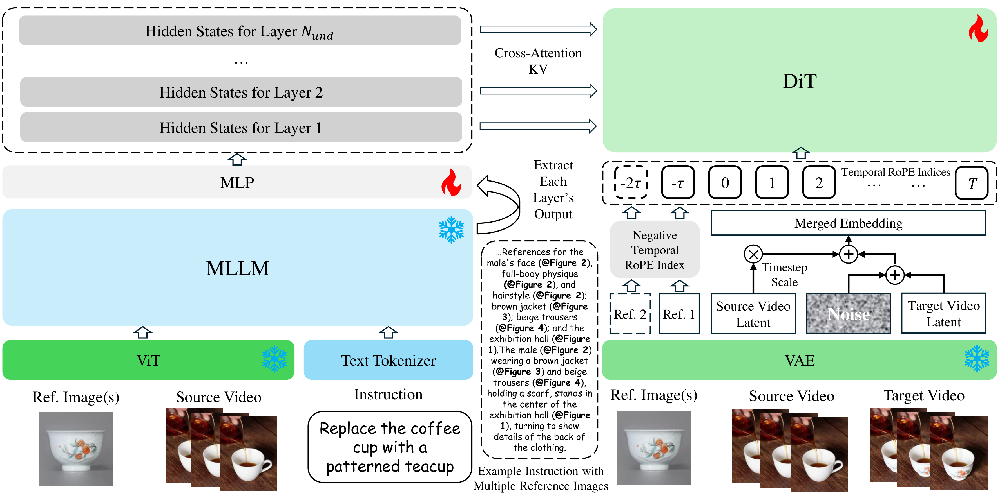
</p>


# 🎯 Supported Tasks

LoomVideo supports **four** unified video generation and editing tasks within a single model:

| Task                          | Input                      | Output  | Description                                             |
| :---------------------------- | :------------------------- | :------ | :------------------------------------------------------ |
| **Text-to-Video**             | Text 📝                     | Video 🎬 | Generate a video from a text prompt                     |
| **Instruction Editing**       | Video 🎬 + Text 📝           | Video 🎬 | Edit a video following text instructions                |
| **Instruction-Image Editing** | Video 🎬 + Image 🖼 + Text 📝 | Video 🎬 | Edit a video with a reference image as guidance         |
| **Multi-Image-to-Video**      | Images 🖼 + Text 📝          | Video 🎬 | Compose multiple reference images into a coherent video |

### 🎬 Text-to-Video

<p align="center">
  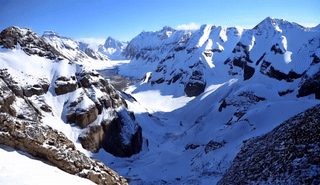
</p>

> **Prompt:** *Snow rocky mountains peaks canyon. Snow blanketed rocky mountains surround and shadow deep canyons. The canyons twist and bend through the high elevated mountain peaks.*

<p align="center">
  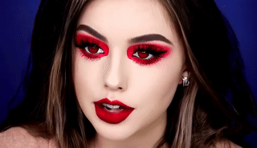
</p>

> **Prompt:** *Vampire makeup face of beautiful girl, red contact lenses.*

### ✂️ Instruction Editing

<table align="center">
  <tr>
    <td align="center" valign="middle"></td>
    <td align="center" valign="middle"><b><font size="5">→</font></b></td>
    <td align="center" valign="middle"></td>
  </tr>
</table>

> **Prompt:** *Apply the Impressionist aesthetic to this video, ensuring seamless temporal consistency across all frames. The result should emulate the fluid brushstroke techniques and atmospheric focus of 19th-century Impressionist art, with each frame retaining the original motion, character actions, and camera movements.*

<table align="center">
  <tr>
    <td align="center" valign="middle">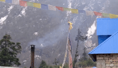</td>
    <td align="center" valign="middle"><b><font size="5">→</font></b></td>
    <td align="center" valign="middle">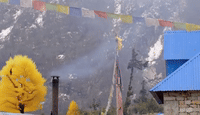</td>
  </tr>
</table>

> **Prompt:** *Replace the tree with a golden-leaved tree that shimmers softly, ensuring it maintains the same position and pose within the video scene.*

### 🖼️ Instruction-Image Editing

<table align="center">
  <tr>
    <td align="center" valign="middle"></td>
    <td align="center" valign="middle">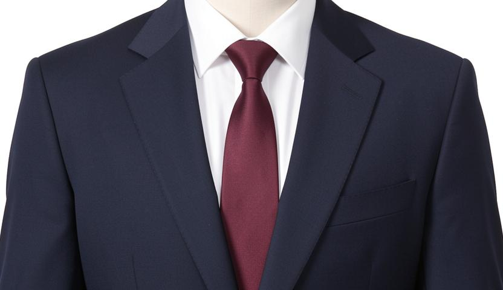</td>
    <td align="center" valign="middle"><b><font size="5">→</font></b></td>
    <td align="center" valign="middle"></td>
  </tr>
</table>

> **Prompt:** *Replace the green t-shirt of the man with the suit in the image.*

<table align="center">
  <tr>
    <td align="center" valign="middle"></td>
    <td align="center" valign="middle"></td>
    <td align="center" valign="middle"><b><font size="5">→</font></b></td>
    <td align="center" valign="middle"></td>
  </tr>
</table>

> **Prompt:** *Replace the background with a Chinese ink painting, featuring a large golden mountain peak rising above swirling clouds, ensuring it appears in the same position and pose within the video scene.*

### 🎞️ Multi-Image-to-Video

<table align="center">
  <tr>
    <td align="center" valign="middle"> 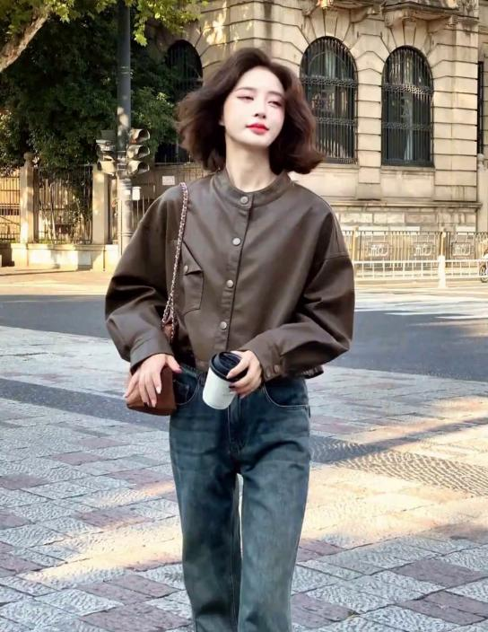 </td>
    <td align="center" valign="middle"><b><font size="5">→</font></b></td>
    <td align="center" valign="middle">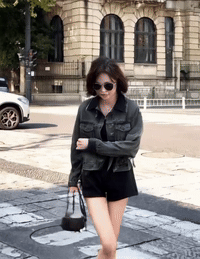</td>
  </tr>
</table>

> **Prompt:** *The girl (@Image 2), wearing the denim jacket (@Image 3), black inner top, and black shorts, wearing sunglasses and carrying the handbag, walks down the street (@Image 1). Then, the girl (@Image 2) stops walking and turns her head to look to one side, followed by the girl (@Image 2) crossing her arms over her chest and striking a confident pose.*

<table align="center">
  <tr>
    <td align="center" valign="middle">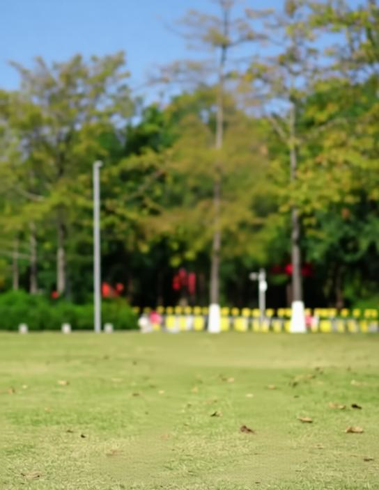 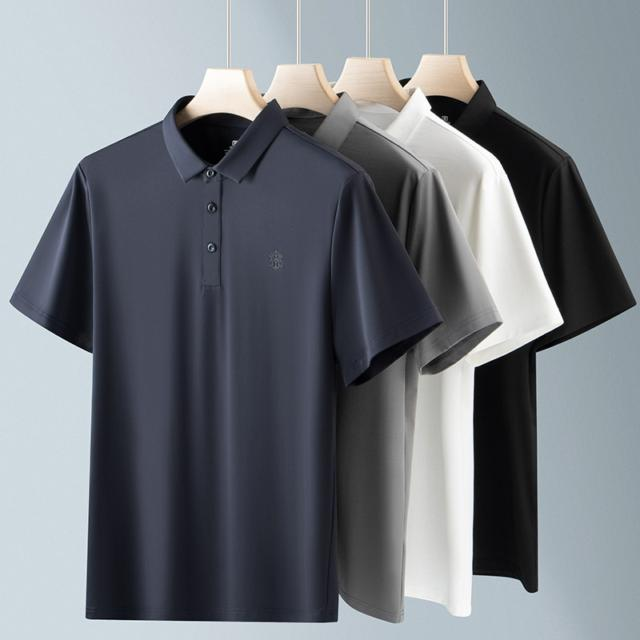</td>
    <td align="center" valign="middle"><b><font size="5">→</font></b></td>
    <td align="center" valign="middle">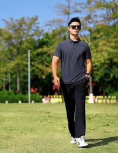</td>
  </tr>
</table>

> **Prompt:** *The man wearing a Polo shirt (@Image 2), black casual pants, white sneakers, sunglasses, and a watch, striding forward on the lawn (@Image 1) with one hand in his pocket.*


# 🔧 Preparation

## Step 1: Clone the Repository

```bash
git clone https://github.com/MSALab-PKU/LoomVideo
cd LoomVideo
```

## Step 2: Install Dependencies

We recommend using [uv](https://github.com/astral-sh/uv) for a fast and fully reproducible environment setup.

```bash
uv sync
source .venv/bin/activate

# (Optional) Include evaluation dependencies
uv sync --extra eval
```

Additionally, install [Flash Attention](https://github.com/Dao-AILab/flash-attention) for faster inference and reduced GPU memory consumption. (for reference, our environment uses v2.7.4)

## Step 3: Download Model Weights

Download the pretrained LoomVideo checkpoint from [Hugging Face](https://huggingface.co/MSALab/LoomVideo) and place it under `checkpoints/LoomVideo/`:

```
checkpoints/LoomVideo/
└── gen_model.pth
```

We provide a helper script to download the weights automatically:

```bash
python hf_download.py
```

You can also specify a custom path via the `--ckpt_path` argument at inference time.

> 💡 Stage 3 model weights are now available. Higher-performance post-trained weights will be released as soon as possible!


# 🎬 Inference
LoomVideo provides a unified inference script that supports **four generation tasks** through a single entry point. Each task is selected via the `--task` flag.

### 1. Text-to-Video / Text-to-Image (`t2v`)

Generate a video from a text description. Default resolution is **480×832** at **81 frames**. When `--num_frames` is set to `1`, the pipeline automatically switches to **image generation** mode and saves the output as a `.jpg` file.

**Required:** `--prompt`

```bash
NUM_GPUS=1

accelerate launch --num_processes=${NUM_GPUS} \
    scripts/inference/generate.py \
    --config_path configs/inference/generation.yaml \
    --ckpt_path checkpoints/LoomVideo \
    --task t2v \
    --prompt "Your prompt here" \
    --height 480 \
    --width 832 \
    --num_frames 97 \
    --num_inference_steps 50 \
    --seed 0 \
    --output_path outputs/t2v.mp4
```

### 2. Instruction Editing (`edit`)

Edit an existing image or video based on a text instruction. The source can be either an image file (`.jpg`, `.png`, etc.) or a video file (`.mp4`). Resolution and frame count are automatically inferred from the source when not specified.

**Required:** `--prompt` `--source_video_path`

```bash
NUM_GPUS=1

accelerate launch --num_processes=${NUM_GPUS} \
    scripts/inference/generate.py \
    --config_path configs/inference/generation.yaml \
    --ckpt_path checkpoints/LoomVideo \
    --task edit \
    --prompt "Your editing instruction here" \
    --source_video_path /path/to/source_video.mp4 \
    --num_inference_steps 50 \
    --seed 0 \
    --output_path outputs/edit.mp4
```

### 3. Instruction-Image Editing (`ref_edit`)

Edit a source video with guidance from one or more reference images along with a text instruction.

**Required:** `--prompt` `--source_video_path` `--ref_image_paths`

```bash
NUM_GPUS=1

accelerate launch --num_processes=${NUM_GPUS} \
    scripts/inference/generate.py \
    --config_path configs/inference/generation.yaml \
    --ckpt_path checkpoints/LoomVideo \
    --task ref_edit \
    --prompt "Your editing instruction" \
    --source_video_path /path/to/source_video.mp4 \
    --ref_image_paths /path/to/ref1.jpg /path/to/ref2.jpg \
    --num_inference_steps 50 \
    --seed 0 \
    --output_path outputs/ref_edit.mp4
```

### 4. Multi-Image-to-Video (`mi2v`)

Generate a video conditioned on multiple reference images and a text prompt. We recommend using `@Image N` in the prompt to reference specific input images.

**Required:** `--prompt` `--ref_image_paths`

```bash
NUM_GPUS=1

accelerate launch --num_processes=${NUM_GPUS} \
    scripts/inference/generate.py \
    --config_path configs/inference/generation.yaml \
    --ckpt_path checkpoints/LoomVideo \
    --task mi2v \
    --prompt "Your prompt here" \
    --ref_image_paths /path/to/img1.jpg /path/to/img2.jpg /path/to/img3.jpg \
    --num_frames 97 \
    --num_inference_steps 50 \
    --seed 0 \
    --output_path outputs/mi2v.mp4
```


## Additional Arguments

The following arguments can be appended to any task command for further customization:

### Generation Control

<table>
  <thead>
    <tr><th>Argument</th><th>Type</th><th>Default</th><th>Description</th></tr>
  </thead>
  <tbody>
    <tr><td nowrap><code>--num_inference_steps</code></td><td>int</td><td><code>50</code></td><td>Number of denoising steps.</td></tr>
    <tr><td nowrap><code>--guidance_scale</code></td><td>float</td><td><code>5.0</code> / <code>2.5</code></td><td>Text CFG scale. <code>5.0</code> for t2v/mi2v, <code>2.5</code> for edit/ref_edit.</td></tr>
    <tr><td nowrap><code>--guidance_scale_visual</code></td><td>float</td><td><code>1.5</code></td><td>Visual CFG scale for source/reference conditioning.</td></tr>
    <tr><td nowrap><code>--negative_prompt</code></td><td>str</td><td><em>(from config)</em></td><td>Negative prompt for quality improvement.</td></tr>
    <tr><td nowrap><code>--seed</code></td><td>int</td><td><code>0</code></td><td>Random seed. Set to <code>-1</code> for random generation.</td></tr>
  </tbody>
</table>

### Resolution & Frames

<table>
  <thead>
    <tr><th>Argument</th><th>Type</th><th>Default</th><th>Description</th></tr>
  </thead>
  <tbody>
    <tr><td nowrap><code>--height</code></td><td>int</td><td><em>auto</em></td><td>Output height. <code>480</code> for t2v; inferred from source for edit.</td></tr>
    <tr><td nowrap><code>--width</code></td><td>int</td><td><em>auto</em></td><td>Output width. <code>832</code> for t2v; inferred from source for edit.</td></tr>
    <tr><td nowrap><code>--num_frames</code></td><td>int</td><td><em>auto</em></td><td>Output frames. <code>81</code> for t2v/mi2v; inferred for edit.</td></tr>
    <tr><td nowrap><code>--fps</code></td><td>int</td><td><code>24</code></td><td>Output video FPS.</td></tr>
  </tbody>
</table>


# 📦 Data Preparation

Since our training relies heavily on proprietary datasets, we are unable to release the original data directly. However, we provide a **flexible data organization framework** that makes it easy to plug in your own data or publicly available datasets.

## Open-Source Datasets

Below are the open-source datasets used in our training. You can download them or substitute with your own data:

| Category                 | Dataset                                                                                                                                                                                                                                                                                                                                                                                                                              |
| ------------------------ | ------------------------------------------------------------------------------------------------------------------------------------------------------------------------------------------------------------------------------------------------------------------------------------------------------------------------------------------------------------------------------------------------------------------------------------ |
| Video Generation         | [Koala-36M](https://huggingface.co/datasets/Koala-36M/Koala-36M-v1), [OpenVid-1M](https://huggingface.co/datasets/nkp37/OpenVid-1M)                                                                                                                                                                                                                                                                                                  |
| Image Editing            | [CrispEdit-2M](https://huggingface.co/datasets/WeiChow/CrispEdit-2M), [OmniGen-2-Edit](https://huggingface.co/OmniGen2), [GPT-Image-Edit-1.5M](https://huggingface.co/datasets/UCSC-VLAA/GPT-Image-Edit-1.5M), [NHR-Edit](https://huggingface.co/datasets/iitolstykh/NHR-Edit), [Pico-Banana](https://github.com/apple/pico-banana-400k), [ShareGPT-4o-Image](https://huggingface.co/datasets/FreedomIntelligence/ShareGPT-4o-Image) |
| Video Editing            | [KIWI-Edit](https://huggingface.co/datasets/linyq/kiwi_edit_training_data)                                                                                                                                                                                                                                                                                                                                                           |
| Video Ref Editing / MI2V | [RefVIE](https://huggingface.co/datasets/linyq/kiwi_edit_training_data), [Phantom-Data](https://huggingface.co/datasets/ZhuoweiChen/Phantom-data-Koala36M)                                                                                                                                                                                                                                                                           |

## Organize Data as Single JSON Files

Each data sample should be stored as an **individual JSON file**, placed in a single directory (e.g., `single_jsons/`), and named sequentially starting from `0.json`:

```
your_dataset/
└── single_jsons/
    ├── 0.json
    ├── 1.json
    ├── 2.json
    ├── ...
```

## JSON Format for Each Task

Each task type expects a specific set of keys in its JSON file. Below are the templates — fill in according to your data:

**Text-to-Video** (`process_t2v_data`):
```json
{
    "text": "A caption describing the video content.",
    "path": "relative/path/to/video.mp4"
}
```

**Text-to-Image** (`process_t2i_data`):
```json
{
    "caption": "A caption describing the image content.",
    "image_path": "relative/path/to/image.jpg"
}
```

**Video Editing** (`process_video_edit_data`):
```json
{
    "source_video_path": "relative/path/to/source_video.mp4",
    "instruction": "The editing instruction.",
    "target_video_path": "relative/path/to/target_video.mp4"
}
```

**Image Editing** (`process_image_edit_data`):
```json
{
    "source_image_path": "relative/path/to/source_image.jpg",
    "instruction": "The editing instruction.",
    "target_image_path": "relative/path/to/target_image.jpg"
}
```

**Multi-Image-to-Video** (`process_t2v_data_withref`):
```json
{
    "instruction": "A prompt describing the video to generate with reference images.",
    "reference_image_paths": [
        "relative/path/to/ref1.jpg",
        "relative/path/to/ref2.jpg"
    ],
    "target_video_path": "relative/path/to/target_video.mp4"
}
```

**Reference-Guided Video Editing** (`process_video_edit_data_withref`):
```json
{
    "source_video_path": "relative/path/to/source_video.mp4",
    "reference_image_paths": [
        "relative/path/to/ref1.jpg"
    ],
    "instruction": "The editing instruction with reference guidance.",
    "target_video_path": "relative/path/to/target_video.mp4"
}
```

> 💡 All paths in JSON files are **relative** to the `data_root` specified in the dataset config.

## Custom Process Functions (Optional)

You may also organize your JSON files in any format you prefer, as long as you implement a corresponding `process_*` function. We provide several reference implementations in `src/dataset/processors.py`. Each process function takes `(dataset_info, data_info)` and returns a list of segments describing the data flow. See the existing functions for examples.

## Dataset Config

Create a YAML config file to register your datasets. See `configs/dataset/train_demo.yaml` as a reference. The config is organized into `train`, `val`, and `eval` sections, each containing dataset entries with the following arguments:

| Argument            | Description                                                                                  |
| ------------------- | -------------------------------------------------------------------------------------------- |
| `task_weight`       | Controls the sampling probability of this task group relative to others during training.     |
| `process_func_name` | Name of the processing function in `src/dataset/processors.py` that parses each JSON sample. |
| `data_root`         | Base directory for resolving relative paths in JSON files.                                   |
| `data_json_dir`     | Directory containing the JSON files (`0.json`, `1.json`, ...).                               |
| `num_samples`       | Total number of samples in the directory.                                                    |
| `sample_weight`     | Sampling weight of this dataset within its task group.                                       |


# 🏋️ Training

## Training Config

The training behavior is fully controlled by a YAML config file (e.g., `configs/train/stage3.yaml`).

**Key arguments:**

| Argument                 | Description                                                    |
| ------------------------ | -------------------------------------------------------------- |
| `log_dir`                | Directory for saving logs, checkpoints, and generated samples. |
| `dataset_config_path`    | Path to the dataset config YAML file.                          |
| `train_steps`            | Total number of training iterations.                           |
| `checkpointing_interval` | Save a checkpoint every N steps.                               |
| `validation_interval`    | Run validation every N steps.                                  |
| `evaluation_interval`    | Run evaluation benchmarks every N steps.                       |

**Model settings:**

| Argument                            | Description                                                                      |
| ----------------------------------- | -------------------------------------------------------------------------------- |
| `model.trainable_modules.gen_model` | Which modules to train. `"all"` trains the full generation model.                |
| `model.gradient_checkpointing`      | Enable gradient checkpointing to reduce GPU memory usage.                        |
| `model.und.pretrained_model_path`   | Path to the pretrained understanding backbone.                                   |
| `model.gen.pretrained_model_path`   | Path to the pretrained generation backbone.                                      |
| `model.pretrained_ckpt_path`        | *(Optional)* Load weights from a previous training stage for continued training. |

**Data settings:**

| Argument                        | Description                                                            |
| ------------------------------- | ---------------------------------------------------------------------- |
| `data.train.resolution_buckets` | List of resolution buckets for dynamic batching.                       |
| `data.train.num_frames`         | Number of frames per training sample.                                  |
| `data.train.fps`                | Video FPS for frame sampling.                                          |
| `data.train.all_dropout_rate`   | Probability of dropping all conditions (for unconditional training).   |
| `data.train.text_dropout_rate`  | Probability of dropping text condition (for classifier-free guidance). |

## Launch Training

Once the data and configs are ready, you can simply start training with:

```bash
NUM_GPUS=8

accelerate launch --num_processes=${NUM_GPUS} \
    -m scripts.train.train \
    --config_path path/to/your/config.yaml
```

> 💡 All training outputs — including checkpoints, EMA weights, logs, and generated samples — are saved under the `log_dir` directory specified in the config.


# 📊 Evaluation

## Environment Setup

### Step 1: Prepare Benchmark Data

We evaluate on the following benchmarks. Download each dataset and organize it into the same **single JSON** format used for training data (see [Data Preparation](#-data-preparation)):

| Benchmark                                                                  | Category                  | Samples |
| -------------------------------------------------------------------------- | ------------------------- | ------- |
| [GenEval](https://github.com/djghosh13/geneval)                            | Image Generation          | 553     |
| [ImgEdit-Bench](https://github.com/pku-yuangroup/imgedit)                  | Image Editing             | 737     |
| [VBench](https://github.com/Vchitect/VBench)                               | Video Generation          | 165     |
| [OpenVE-Bench](https://huggingface.co/datasets/Lewandofski/OpenVE-Bench)   | Video Editing             | 431     |
| [RefVIE-Bench](https://huggingface.co/datasets/linyq/RefVIE-Bench)         | Reference Video Editing   | 120     |
| [Intelligent-VBench-MI2V](https://github.com/Tencent-Hunyuan/OmniWeaving)  | Multi-Image-to-Video      | 320     |
| [Intelligent-VBench-TIV2V](https://github.com/Tencent-Hunyuan/OmniWeaving) | Text-Image-Video-to-Video | 210     |

> 💡 For **Intelligent-VBench**, we split the original benchmark into two subsets based on task type — **MI2V** and **TIV2V**. Their JSON files should be placed in separate directories.

After downloading, update the `data_root` and `data_json_dir` paths in `configs/dataset/benchmarks.yaml` to point to your local directories.

### Step 2: Install Evaluation Dependencies

**VBench:**

```bash
mkdir -p libs && cd libs
git clone https://github.com/Vchitect/VBench.git
```

Add the following to `libs/VBench/vbench/__init__.py`:

```python
import sys, os
local_lib_path = os.path.abspath("libs/VBench")
if local_lib_path not in sys.path:
    sys.path.append(local_lib_path)
```

If you encounter a NumPy 2.0 compatibility error (`np.sctypes was removed`), modify lines 45–47 of `[YOUR_PYTHON_LIBS]/imgaug/imgaug.py`:

```python
# Replace:
# NP_FLOAT_TYPES = set(np.sctypes["float"])
# NP_INT_TYPES = set(np.sctypes["int"])
# NP_UINT_TYPES = set(np.sctypes["uint"])

# With:
NP_FLOAT_TYPES = {np.float16, np.float32, np.float64, np.longdouble}
NP_INT_TYPES = {np.int8, np.int16, np.int32, np.int64, np.longlong}
NP_UINT_TYPES = {np.uint8, np.uint16, np.uint32, np.uint64, np.ulonglong}
```

To save disk space, remove unnecessary files:

```bash
rm -rf libs/VBench/VBench-2.0 libs/VBench/.git libs/VBench/asset libs/VBench/vbench2_beta_trustworthiness
```

**GenEval:**

```bash
cd libs
git clone https://github.com/djghosh13/geneval.git
cd geneval
./evaluation/download_models.sh "../../checkpoints/"

cd ..
pip install mmcv-full
git clone https://github.com/open-mmlab/mmdetection.git
cd mmdetection && git checkout 2.x
pip install -v -e . --no-build-isolation
```

The GenEval model paths are configured in `configs/evaluation/evaluation.yaml` under `model.evaluation.geneval`:

```yaml
model:
  evaluation:
    geneval:
      model_path: checkpoints/evaluation/mask2former_swin-s-p4-w7-224_lsj_8x2_50e_coco.pth
      model_config_path: libs/mmdetection/configs/mask2former/mask2former_swin-s-p4-w7-224_lsj_8x2_50e_coco.py
      clip_path: checkpoints/evaluation/ViT-L-14.pt
```

### Step 3: Configure API Keys

Some benchmarks (OpenVE-Bench, RefVIE-Bench, ImgEdit-Bench, Intelligent-VBench) require LLM API calls for metric computation. Configure your API keys in `configs/evaluation/evaluation.yaml` under `model.evaluation`:

```yaml
model:
  evaluation:
    # For OpenVE-Bench, RefVIE-Bench, Intelligent-VBench
    gemini:
      api_key: "YOUR_GEMINI_API_KEY"
      base_url: "YOUR_GEMINI_BASE_URL"
      model: "gemini-2.5-pro-06-17"
    # For ImgEdit-Bench
    openai:
      api_key: "YOUR_OPENAI_API_KEY"
      base_url: "YOUR_OPENAI_BASE_URL"
      model: "gpt-4.1"
```


## Run Evaluation

Once the environment is set up, you can simply run evaluation with:

```bash
NUM_GPUS=8

accelerate launch --num_processes=${NUM_GPUS} \
    -m scripts.evaluation.evaluate \
    --config configs/evaluation/evaluation.yaml \
    --checkpoint_dir checkpoints/LoomVideo \
    --generation_configs configs/dataset/benchmarks.yaml \
    --output_dir results/evaluation \
    --calculate_metrics
```


# 📧 Contact

Jianzong Wu (吴健宗): jzwu@stu.pku.edu.cn


# 📄 Citation

If you find our work helpful, please consider giving us a ⭐ on this repo and citing our paper as follows:

```bibtex
@article{wu2026loomvideo,
  title={LoomVideo: Unifying Multimodal Inputs into Video Generation and Editing},
  author={Wu, Jianzong and Lian, Hao and Yang, Jiongfan and Hao, Dachao and Tian, Ye and Tong, Yunhai and Zhu, Jingyuan and Chen, Biaolong and Qi, Qiaosong and Zhang, Aixi and He, Wanggui and Liu, Mushui and Jiang, Hao},
  journal={arXiv preprint arXiv:2606.06042},
  year={2026}
}
```